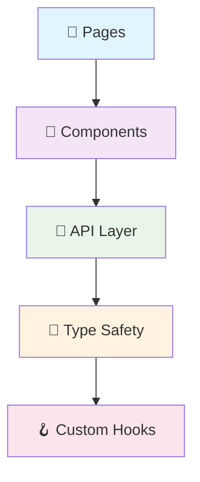
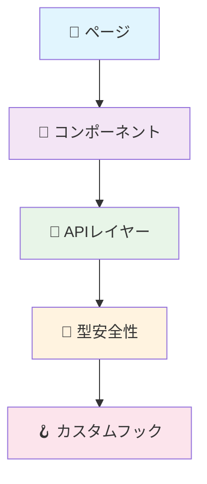

<div align="center">

# 🎨✨ Uma Musume Notes - Frontend ✨🎨

<p align="center">
  
  
  
  
</p>

<p align="center">
  <strong>🌟 Modern React Frontend for Uma Musume Notes Database 🌟</strong>
</p>

</div>

---

<div align="center">

## 🌐 Language Selection

<table>
<tr>
<td align="center">
  <a href="#-uma-musume-notes---frontend-indonesia">
    
  </a>
</td>
<td align="center">
  <a href="#-uma-musume-notes---frontend-english">
    
  </a>
</td>
<td align="center">
  <a href="#-uma-musume-notes---frontend-japanese">
    
  </a>
</td>
</tr>
</table>

</div>

---

# 🎨 Uma Musume Notes - Frontend (Indonesia)

<div align="center">

## 📊 Language Composition

<table>
<tr>
<td align="center">
  
  <br><sub><strong>Primary Language</strong></sub>
</td>
<td align="center">
  
  <br><sub><strong>Styling</strong></sub>
</td>
<td align="center">
  
  <br><sub><strong>Configuration</strong></sub>
</td>
<td align="center">
  
  <br><sub><strong>Templates</strong></sub>
</td>
</tr>
</table>

</div>

> **Uma Musume Notes Frontend** adalah aplikasi web modern yang dibangun dengan React dan TypeScript untuk menyediakan interface yang user-friendly dalam menjelajahi database Uma Musume Pretty Derby.

<details>
<summary>📋 <strong>Daftar Isi</strong></summary>

- [🎯 Tujuan](#-tujuan)
- [🛠️ Tech Stack](#️-tech-stack)
- [🎨 Design System](#-design-system)
- [✨ Fitur Utama](#-fitur-utama)
- [🚀 Quick Start](#-quick-start)
- [📱 Demo](#-demo)
- [🔌 API Integration](#-api-integration)
- [📁 Project Structure](#-project-structure)

</details>

## 🎯 Tujuan

<div align="center">
<table>
<tr>
<td align="center" width="20%">
  
  <br><strong>🗄️ Database Explorer</strong>
  <br><sub>Interface intuitif untuk browsing</sub>
</td>
<td align="center" width="20%">
  
  <br><strong>📊 Collection Tracker</strong>
  <br><sub>Sistem tracking personal</sub>
</td>
<td align="center" width="20%">
  
  <br><strong>📱 Responsive Design</strong>
  <br><sub>Optimized semua device</sub>
</td>
<td align="center" width="20%">
  
  <br><strong>🔄 Real-time Updates</strong>
  <br><sub>Integrasi dengan backend API</sub>
</td>
<td align="center" width="20%">
  
  <br><strong>🎨 Modern UI/UX</strong>
  <br><sub>Clean design & animations</sub>
</td>
</tr>
</table>
</div>

## 🛠️ Tech Stack

<div align="center">

### 🎨 Frontend Technologies
<p>
  
  
  
  
  
  
  
</p>

### 🔧 Development Tools
<p>
  
  
  
  
</p>

</div>

## 🎨 Design System

<div align="center">

### 🌈 Custom Color Palette

<table>
<tr>
<td align="center">
  <div style="background: #667eea; width: 50px; height: 30px; border-radius: 4px;"></div>
  <br><code>--uma-blue</code>
  <br><sub>Primary Brand</sub>
</td>
<td align="center">
  <div style="background: #764ba2; width: 50px; height: 30px; border-radius: 4px;"></div>
  <br><code>--uma-purple</code>
  <br><sub>Secondary Brand</sub>
</td>
<td align="center">
  <div style="background: #f59e0b; width: 50px; height: 30px; border-radius: 4px;"></div>
  <br><code>--uma-gold</code>
  <br><sub>Accent Color</sub>
</td>
</tr>
</table>

### ⭐ Aptitude Color System

<p>
  
  
  
  
  
  
  
  
</p>

</div>

## ✨ Fitur Utama

<div align="center">
<table>
<tr>
<td align="center" width="33%">
  <h3>🏠 Homepage - Database Explorer</h3>
  <ul align="left">
    <li>🎯 <strong>Hero Section</strong> dengan search functionality</li>
    <li>🌟 <strong>Featured Collections</strong> showcase items</li>
    <li>📊 <strong>Database Statistics</strong> live dari API</li>
    <li>📱 <strong>Responsive Grid</strong> optimized layout</li>
    <li>🎬 <strong>Smooth Navigation</strong> animated scrolling</li>
  </ul>
</td>
<td align="center" width="33%">
  <h3>📈 Progress Tracker Page</h3>
  <ul align="left">
    <li>💼 <strong>Personal Collection</strong> track items</li>
    <li>🏃 <strong>Trained Uma Management</strong> detail stats</li>
    <li>📊 <strong>Collection Statistics</strong> visual progress</li>
    <li>➕ <strong>Add New Items</strong> modal interface</li>
    <li>👀 <strong>View All Pages</strong> paginated view</li>
  </ul>
</td>
<td align="center" width="33%">
  <h3>🎨 UI/UX Features</h3>
  <ul align="left">
    <li>📱 <strong>Responsive Design</strong> mobile-first</li>
    <li>🃏 <strong>Card Components</strong> consistent design</li>
    <li>⏳ <strong>Loading States</strong> skeleton & spinners</li>
    <li>❌ <strong>Error Handling</strong> user-friendly messages</li>
    <li>✨ <strong>Smooth Animations</strong> CSS transitions</li>
  </ul>
</td>
</tr>
</table>
</div>

## 🚀 Quick Start

### 📋 Prerequisites

<div align="center">
<table>
<tr>
<td align="center">
  
</td>
<td align="center">
  
</td>
<td align="center">
  
</td>
</tr>
</table>
</div>

### ⚡ Installation Steps

<details>
<summary>📥 <strong>1. Clone Repository</strong></summary>

```bash
git clone https://github.com/zakkutsu/uma-notes-fe.git
cd uma-notes-fe
```

</details>

<details>
<summary>📦 <strong>2. Install Dependencies</strong></summary>

```bash
# Using npm
npm install

# Using yarn
yarn install
```

</details>

<details>
<summary>⚙️ <strong>3. Setup Environment</strong></summary>

Buat file `.env` di root directory:

```env
# API Configuration
VITE_API_BASE_URL=http://localhost:3000/api/v1

# App Configuration
VITE_APP_TITLE=Uma Musume Notes
VITE_APP_VERSION=1.0.0
```

</details>

<details>
<summary>🚀 <strong>4. Run Development Server</strong></summary>

```bash
# Development mode dengan hot reload
npm run dev

# Server akan berjalan di http://localhost:5173
```

</details>

## 🔌 API Integration

<div align="center">

### 🪝 React Query Hooks

<table>
<tr>
<th>🏷️ Entity</th>
<th>📖 Read Hooks</th>
<th>✏️ Mutation Hooks</th>
</tr>
<tr>
<td><strong>🐎 Uma</strong></td>
<td><code>useUmas()</code>, <code>useUma(id)</code></td>
<td><code>useCreateUma()</code>, <code>useUpdateUma()</code>, <code>useDeleteUma()</code></td>
</tr>
<tr>
<td><strong>⚡ Skill</strong></td>
<td><code>useSkills()</code>, <code>useSkill(id)</code></td>
<td><code>useCreateSkill()</code>, <code>useUpdateSkill()</code>, <code>useDeleteSkill()</code></td>
</tr>
<tr>
<td><strong>🃏 Support Card</strong></td>
<td><code>useSupportCards()</code>, <code>useSupportCard(id)</code></td>
<td><em>Read-only</em></td>
</tr>
<tr>
<td><strong>🧬 Factor</strong></td>
<td><code>useFactors()</code>, <code>useFactor(id)</code></td>
<td><em>Read-only</em></td>
</tr>
</table>

</div>

---

<div align="center">

**🎉 Happy Coding! 🐎✨**

</div>

---

# 🎨 Uma Musume Notes - Frontend (English)

<div align="center">

## 📊 Language Composition

<table>
<tr>
<td align="center">
  
  <br><sub><strong>Primary Language</strong></sub>
</td>
<td align="center">
  
  <br><sub><strong>Styling</strong></sub>
</td>
<td align="center">
  
  <br><sub><strong>Configuration</strong></sub>
</td>
<td align="center">
  
  <br><sub><strong>Templates</strong></sub>
</td>
</tr>
</table>

</div>

> **Uma Musume Notes Frontend** is a modern web application built with React and TypeScript to provide a user-friendly interface for exploring the Uma Musume Pretty Derby database.

<details>
<summary>📋 <strong>Table of Contents</strong></summary>

- [🎯 Objectives](#-objectives)
- [🛠️ Tech Stack](#️-tech-stack-1)
- [🎨 Design System](#-design-system-1)
- [✨ Key Features](#-key-features)
- [🚀 Quick Start](#-quick-start-1)
- [📱 Demo](#-demo)
- [🔌 API Integration](#-api-integration-1)
- [📁 Project Structure](#-project-structure)

</details>

## 🎯 Objectives

<div align="center">
<table>
<tr>
<td align="center" width="20%">
  
  <br><strong>🗄️ Database Explorer</strong>
  <br><sub>Intuitive browsing interface</sub>
</td>
<td align="center" width="20%">
  
  <br><strong>📊 Collection Tracker</strong>
  <br><sub>Personal tracking system</sub>
</td>
<td align="center" width="20%">
  
  <br><strong>📱 Responsive Design</strong>
  <br><sub>All device optimization</sub>
</td>
<td align="center" width="20%">
  
  <br><strong>🔄 Real-time Updates</strong>
  <br><sub>Backend API integration</sub>
</td>
<td align="center" width="20%">
  
  <br><strong>🎨 Modern UI/UX</strong>
  <br><sub>Clean design & animations</sub>
</td>
</tr>
</table>
</div>

## 🛠️ Tech Stack

<div align="center">

### 🎨 Frontend Technologies
<p>
  
  
  
  
  
  
  
</p>

### 🔧 Development Tools
<p>
  
  
  
  
</p>

</div>

<details>
<summary>🏗️ <strong>Architecture Overview</strong></summary>

The application uses **component-based architecture** with:



- **Pages**: Route-level components (HomePage, ProgressTrackerPage, ViewAllPage)
- **Components**: Reusable UI components (Cards, Modals, Header, SearchBar)
- **API Layer**: Centralized API calls with React Query hooks
- **Type Safety**: Full TypeScript coverage for type safety
- **Custom Hooks**: Encapsulated logic in reusable hooks

</details>

## 🎨 Design System

<div align="center">

### 🌈 Custom Color Palette

<table>
<tr>
<td align="center">
  <div style="background: #667eea; width: 50px; height: 30px; border-radius: 4px;"></div>
  <br><code>--uma-blue</code>
  <br><sub>Primary Brand</sub>
</td>
<td align="center">
  <div style="background: #764ba2; width: 50px; height: 30px; border-radius: 4px;"></div>
  <br><code>--uma-purple</code>
  <br><sub>Secondary Brand</sub>
</td>
<td align="center">
  <div style="background: #f59e0b; width: 50px; height: 30px; border-radius: 4px;"></div>
  <br><code>--uma-gold</code>
  <br><sub>Accent Color</sub>
</td>
</tr>
</table>

### ⭐ Aptitude Color System

<p>
  
  
  
  
  
  
  
  
</p>

</div>

## ✨ Key Features

<div align="center">
<table>
<tr>
<td align="center" width="33%">
  <h3>🏠 Homepage - Database Explorer</h3>
  <ul align="left">
    <li>🎯 <strong>Hero Section</strong> with search functionality</li>
    <li>🌟 <strong>Featured Collections</strong> showcase items</li>
    <li>📊 <strong>Database Statistics</strong> live from API</li>
    <li>📱 <strong>Responsive Grid</strong> optimized layout</li>
    <li>🎬 <strong>Smooth Navigation</strong> animated scrolling</li>
  </ul>
</td>
<td align="center" width="33%">
  <h3>📈 Progress Tracker Page</h3>
  <ul align="left">
    <li>💼 <strong>Personal Collection</strong> track items</li>
    <li>🏃 <strong>Trained Uma Management</strong> detailed stats</li>
    <li>📊 <strong>Collection Statistics</strong> visual progress</li>
    <li>➕ <strong>Add New Items</strong> modal interface</li>
    <li>👀 <strong>View All Pages</strong> paginated view</li>
  </ul>
</td>
<td align="center" width="33%">
  <h3>🎨 UI/UX Features</h3>
  <ul align="left">
    <li>📱 <strong>Responsive Design</strong> mobile-first</li>
    <li>🃏 <strong>Card Components</strong> consistent design</li>
    <li>⏳ <strong>Loading States</strong> skeleton & spinners</li>
    <li>❌ <strong>Error Handling</strong> user-friendly messages</li>
    <li>✨ <strong>Smooth Animations</strong> CSS transitions</li>
  </ul>
</td>
</tr>
</table>
</div>

## 🚀 Quick Start

### 📋 Prerequisites

<div align="center">
<table>
<tr>
<td align="center">
  
</td>
<td align="center">
  
</td>
<td align="center">
  
</td>
</tr>
</table>
</div>

### ⚡ Installation Steps

<details>
<summary>📥 <strong>1. Clone Repository</strong></summary>

```bash
git clone https://github.com/zakkutsu/uma-notes-fe.git
cd uma-notes-fe
```

</details>

<details>
<summary>📦 <strong>2. Install Dependencies</strong></summary>

```bash
# Using npm
npm install

# Using yarn
yarn install
```

</details>

<details>
<summary>⚙️ <strong>3. Setup Environment</strong></summary>

Create `.env` file in root directory:

```env
# API Configuration
VITE_API_BASE_URL=http://localhost:3000/api/v1

# App Configuration
VITE_APP_TITLE=Uma Musume Notes
VITE_APP_VERSION=1.0.0
```

</details>

<details>
<summary>🚀 <strong>4. Run Development Server</strong></summary>

```bash
# Development mode with hot reload
npm run dev

# Server will run at http://localhost:5173
```

</details>

## 📱 Demo

### 🌐 Application Pages

<div align="center">
<table>
<tr>
<th>📄 Page</th>
<th>🔗 Route</th>
<th>📋 Description</th>
</tr>
<tr>
<td>🏠 <strong>Homepage</strong></td>
<td><code>/</code></td>
<td>Database explorer with featured items</td>
</tr>
<tr>
<td>📈 <strong>Progress Tracker</strong></td>
<td><code>/progress</code></td>
<td>Personal collection management</td>
</tr>
<tr>
<td>👀 <strong>View All Pages</strong></td>
<td><code>/view-all/*</code></td>
<td>Paginated item display</td>
</tr>
</table>
</div>

### 📱 Responsive Testing

<div align="center">
<table>
<tr>
<td align="center" width="33%">
  <strong>🖥️ Desktop</strong><br/>
  <sub>1024px+ (Full layout)</sub>
</td>
<td align="center" width="33%">
  <strong>📱 Tablet</strong><br/>
  <sub>768px-1023px (Adjusted grid)</sub>
</td>
<td align="center" width="33%">
  <strong>📱 Mobile</strong><br/>
  <sub>320px-767px (Mobile optimized)</sub>
</td>
</tr>
</table>
</div>

### ⚡ Performance Features

<div align="center">
<p>
  
  
  
  
</p>
</div>

### 🌐 Browser Support

<div align="center">
<p>
  
  
  
  
</p>
</div>

## 🔌 API Integration

<div align="center">

### 🪝 React Query Hooks

<table>
<tr>
<th>🏷️ Entity</th>
<th>📖 Read Hooks</th>
<th>✏️ Mutation Hooks</th>
</tr>
<tr>
<td><strong>🐎 Uma</strong></td>
<td><code>useUmas()</code>, <code>useUma(id)</code></td>
<td><code>useCreateUma()</code>, <code>useUpdateUma()</code>, <code>useDeleteUma()</code></td>
</tr>
<tr>
<td><strong>⚡ Skill</strong></td>
<td><code>useSkills()</code>, <code>useSkill(id)</code></td>
<td><code>useCreateSkill()</code>, <code>useUpdateSkill()</code>, <code>useDeleteSkill()</code></td>
</tr>
<tr>
<td><strong>🃏 Support Card</strong></td>
<td><code>useSupportCards()</code>, <code>useSupportCard(id)</code></td>
<td><em>Read-only</em></td>
</tr>
<tr>
<td><strong>🧬 Factor</strong></td>
<td><code>useFactors()</code>, <code>useFactor(id)</code></td>
<td><em>Read-only</em></td>
</tr>
<tr>
<td><strong>🏃 Trained Uma</strong></td>
<td><code>useTrainedUmas()</code>, <code>useTrainedUma(id)</code></td>
<td><em>Read-only</em></td>
</tr>
</table>

</div>

<details>
<summary>💻 <strong>API Usage Example</strong></summary>

```tsx
import { useUmas, useCreateUma } from '@/api';

function UmaList() {
  // 📖 Fetch data with pagination
  const { data: umasResponse, isLoading, error } = useUmas({ 
    page: 1, 
    limit: 10 
  });
  
  // ✏️ Create mutation
  const createMutation = useCreateUma();
  
  // 🎯 Handle create
  const handleCreate = (newUmaData: CreateUmaRequest) => {
    createMutation.mutate(newUmaData, {
      onSuccess: () => {
        alert('Uma created successfully! 🎉');
      },
      onError: (error) => {
        alert(`Error: ${error.message} ❌`);
      }
    });
  };
  
  // 🔄 Loading state
  if (isLoading) return <div>Loading umas... ⏳</div>;
  if (error) return <div>Error: {error.message} ❌</div>;
  
  // 📊 Access data
  const umas = umasResponse?.data || [];
  const pagination = umasResponse?.pagination;
  
  return (
    <div>
      <h1>Umas ({pagination?.totalRows}) 🐎</h1>
      {umas.map(uma => (
        <div key={uma.id}>{uma.name}</div>
      ))}
    </div>
  );
}
```

</details>

## 📁 Project Structure

<details>
<summary>🏗️ <strong>Directory Structure</strong></summary>

```
📁 uma-notes-fe/
├── 📄 index.html            # HTML entry point
├── 📄 vite.config.ts        # Vite configuration
├── 📄 tailwind.config.js    # Tailwind CSS configuration
├── 📄 eslint.config.js      # ESLint configuration
├── 📄 postcss.config.mjs    # PostCSS configuration
├── 📄 tsconfig.json         # TypeScript configuration
├── 📁 public/              # Static assets
└── 📁 src/                 # Source code
    ├── 📄 main.tsx          # React entry point
    ├── 📄 App.tsx           # Main App component
    ├── 📄 index.css         # Global styles & Tailwind imports
    ├── 📁 components/       # 🧩 Reusable UI components
    │   ├── 📄 Cards.tsx     # Uma, SupportCard, Skill, Factor cards
    │   ├── 📄 Header.tsx    # Navigation header with routing
    │   ├── 📄 SearchBar.tsx # Search functionality
    │   ├── 📄 Modal.tsx     # Base modal component
    │   └── 📄 AddItemModal.tsx # Add new item modal
    ├── 📁 pages/           # 📄 Route-level pages
    │   ├── 📄 HomePage.tsx  # Database explorer homepage
    │   ├── 📄 ProgressTrackerPage.tsx # Personal collection tracker
    │   └── 📄 ViewAllPage.tsx # Paginated view all page
    ├── 📁 api/             # 🔌 API layer & hooks
    │   ├── 📁 hooks/       # React Query hooks
    │   ├── 📄 config.ts    # Axios configuration
    │   └── 📄 [entity].ts  # API functions per entity
    ├── 📁 types/           # 📝 TypeScript type definitions
    ├── 📁 constants/       # ⚙️ App constants & sample data
    ├── 📁 utils/           # 🛠️ Utility functions
    └── 📁 layout/          # 🏗️ Layout components
```

</details>

## 🎮 Features Overview

<div align="center">
<table>
<tr>
<th>✅ Core Features</th>
<th>🎨 UI/UX Features</th>
<th>🔌 API Features</th>
</tr>
<tr>
<td>
  ✅ Homepage Explorer<br/>
  ✅ Collection Tracker<br/>
  ✅ Responsive Design<br/>
  ✅ Search Functionality<br/>
  ✅ Smooth Navigation<br/>
  ✅ Card Components
</td>
<td>
  ✅ Header Navigation<br/>
  ✅ Modal System<br/>
  ✅ Loading States<br/>
  ✅ Error Handling<br/>
  ✅ Hover Effects<br/>
  ✅ Layout System
</td>
<td>
  ✅ React Query Setup<br/>
  ✅ API Client (Axios)<br/>
  ✅ Custom Hooks<br/>
  ✅ Type Safety<br/>
  ✅ Error Management<br/>
  ✅ Cache Invalidation
</td>
</tr>
</table>
</div>

## 🔗 Related Repositories

<div align="center">
<table>
<tr>
<td align="center">
  <a href="https://github.com/zakkutsu/uma-notes-be.git">
    
  </a>
  <br><sub>Backend API with Node.js + Express</sub>
</td>
<td align="center">
  <a href="https://github.com/zakkutsu/uma-notes.git">
    
  </a>
  <br><sub>Project documentation & overview</sub>
</td>
</tr>
</table>
</div>

---

<div align="center">

**🎉 Happy Coding! 🐎✨**

</div>

---

# 🎨 Uma Musume Notes - Frontend (Japanese)

<div align="center">

## 📊 言語構成

<table>
<tr>
<td align="center">
  
  <br><sub><strong>主要言語</strong></sub>
</td>
<td align="center">
  
  <br><sub><strong>スタイリング</strong></sub>
</td>
<td align="center">
  
  <br><sub><strong>設定</strong></sub>
</td>
<td align="center">
  
  <br><sub><strong>テンプレート</strong></sub>
</td>
</tr>
</table>

</div>

> **Uma Musume Notes Frontend** は、ReactとTypeScriptで構築されたモダンなWebアプリケーションで、ウマ娘 プリティーダービーデータベースを探索するためのユーザーフレンドリーなインターフェースを提供します。

<details>
<summary>📋 <strong>目次</strong></summary>

- [🎯 目標](#-目標)
- [🛠️ 技術スタック](#️-技術スタック)
- [🎨 デザインシステム](#-デザインシステム)
- [✨ 主な機能](#-主な機能)
- [🚀 クイックスタート](#-クイックスタート)
- [📱 デモ](#-デモ)
- [🔌 API統合](#-api統合)
- [📁 プロジェクト構造](#-プロジェクト構造)

</details>

## 🎯 目標

<div align="center">
<table>
<tr>
<td align="center" width="20%">
  
  <br><strong>🗄️ データベースエクスプローラー</strong>
  <br><sub>直感的なブラウジングインターフェース</sub>
</td>
<td align="center" width="20%">
  
  <br><strong>📊 コレクショントラッカー</strong>
  <br><sub>個人追跡システム</sub>
</td>
<td align="center" width="20%">
  
  <br><strong>📱 レスポンシブデザイン</strong>
  <br><sub>全デバイス最適化</sub>
</td>
<td align="center" width="20%">
  
  <br><strong>🔄 リアルタイム更新</strong>
  <br><sub>バックエンドAPI統合</sub>
</td>
<td align="center" width="20%">
  
  <br><strong>🎨 モダンUI/UX</strong>
  <br><sub>クリーンデザイン & アニメーション</sub>
</td>
</tr>
</table>
</div>

## 🛠️ 技術スタック

<div align="center">

### 🎨 フロントエンド技術
<p>
  
  
  
  
  
  
  
</p>

### 🔧 開発ツール
<p>
  
  
  
  
</p>

</div>

<details>
<summary>🏗️ <strong>アーキテクチャ概要</strong></summary>

アプリケーションは**コンポーネントベースアーキテクチャ**を使用：



- **ページ**: ルートレベルコンポーネント (HomePage, ProgressTrackerPage, ViewAllPage)
- **コンポーネント**: 再利用可能なUIコンポーネント (Cards, Modals, Header, SearchBar)
- **APIレイヤー**: React Query フックによる集中API呼び出し
- **型安全性**: 型安全性のための完全なTypeScriptカバレッジ
- **カスタムフック**: 再利用可能なフックにカプセル化されたロジック

</details>

## 🎨 デザインシステム

<div align="center">

### 🌈 カスタムカラーパレット

<table>
<tr>
<td align="center">
  <div style="background: #667eea; width: 50px; height: 30px; border-radius: 4px;"></div>
  <br><code>--uma-blue</code>
  <br><sub>プライマリブランド</sub>
</td>
<td align="center">
  <div style="background: #764ba2; width: 50px; height: 30px; border-radius: 4px;"></div>
  <br><code>--uma-purple</code>
  <br><sub>セカンダリブランド</sub>
</td>
<td align="center">
  <div style="background: #f59e0b; width: 50px; height: 30px; border-radius: 4px;"></div>
  <br><code>--uma-gold</code>
  <br><sub>アクセントカラー</sub>
</td>
</tr>
</table>

### ⭐ 適性カラーシステム

<p>
  
  
  
  
  
  
  
  
</p>

</div>

## ✨ 主な機能

<div align="center">
<table>
<tr>
<td align="center" width="33%">
  <h3>🏠 ホームページ - データベースエクスプローラー</h3>
  <ul align="left">
    <li>🎯 <strong>ヒーローセクション</strong> 検索機能付き</li>
    <li>🌟 <strong>注目コレクション</strong> アイテム紹介</li>
    <li>📊 <strong>データベース統計</strong> APIからライブ</li>
    <li>📱 <strong>レスポンシブグリッド</strong> 最適化レイアウト</li>
    <li>🎬 <strong>スムーズナビゲーション</strong> アニメーションスクロール</li>
  </ul>
</td>
<td align="center" width="33%">
  <h3>📈 プログレストラッカーページ</h3>
  <ul align="left">
    <li>💼 <strong>個人コレクション</strong> アイテム追跡</li>
    <li>🏃 <strong>育成ウマ娘管理</strong> 詳細ステータス</li>
    <li>📊 <strong>コレクション統計</strong> ビジュアル進捗</li>
    <li>➕ <strong>新規アイテム追加</strong> モーダルインターフェース</li>
    <li>👀 <strong>全て表示ページ</strong> ページネーション表示</li>
  </ul>
</td>
<td align="center" width="33%">
  <h3>🎨 UI/UX機能</h3>
  <ul align="left">
    <li>📱 <strong>レスポンシブデザイン</strong> モバイルファースト</li>
    <li>🃏 <strong>カードコンポーネント</strong> 一貫性のあるデザイン</li>
    <li>⏳ <strong>ローディングステート</strong> スケルトン & スピナー</li>
    <li>❌ <strong>エラーハンドリング</strong> ユーザーフレンドリーメッセージ</li>
    <li>✨ <strong>スムーズアニメーション</strong> CSSトランジション</li>
  </ul>
</td>
</tr>
</table>
</div>

## 🚀 クイックスタート

### 📋 前提条件

<div align="center">
<table>
<tr>
<td align="center">
  
</td>
<td align="center">
  
</td>
<td align="center">
  
</td>
</tr>
</table>
</div>

### ⚡ インストール手順

<details>
<summary>📥 <strong>1. リポジトリのクローン</strong></summary>

```bash
git clone https://github.com/zakkutsu/uma-notes-fe.git
cd uma-notes-fe
```

</details>

<details>
<summary>📦 <strong>2. 依存関係のインストール</strong></summary>

```bash
# npmを使用
npm install

# yarnを使用
yarn install
```

</details>

<details>
<summary>⚙️ <strong>3. 環境設定</strong></summary>

ルートディレクトリに`.env`ファイルを作成：

```env
# API設定
VITE_API_BASE_URL=http://localhost:3000/api/v1

# アプリ設定
VITE_APP_TITLE=Uma Musume Notes
VITE_APP_VERSION=1.0.0
```

</details>

<details>
<summary>🚀 <strong>4. 開発サーバーの実行</strong></summary>

```bash
# ホットリロード付き開発モード
npm run dev

# サーバーは http://localhost:5173 で実行されます
```

</details>

## 📱 デモ

### 🌐 アプリケーションページ

<div align="center">
<table>
<tr>
<th>📄 ページ</th>
<th>🔗 ルート</th>
<th>📋 説明</th>
</tr>
<tr>
<td>🏠 <strong>ホームページ</strong></td>
<td><code>/</code></td>
<td>注目アイテム付きデータベースエクスプローラー</td>
</tr>
<tr>
<td>📈 <strong>プログレストラッカー</strong></td>
<td><code>/progress</code></td>
<td>個人コレクション管理</td>
</tr>
<tr>
<td>👀 <strong>全て表示ページ</strong></td>
<td><code>/view-all/*</code></td>
<td>ページネーションアイテム表示</td>
</tr>
</table>
</div>

### 📱 レスポンシブテスト

<div align="center">
<table>
<tr>
<td align="center" width="33%">
  <strong>🖥️ デスクトップ</strong><br/>
  <sub>1024px+ (フルレイアウト)</sub>
</td>
<td align="center" width="33%">
  <strong>📱 タブレット</strong><br/>
  <sub>768px-1023px (調整されたグリッド)</sub>
</td>
<td align="center" width="33%">
  <strong>📱 モバイル</strong><br/>
  <sub>320px-767px (モバイル最適化)</sub>
</td>
</tr>
</table>
</div>

### ⚡ パフォーマンス機能

<div align="center">
<p>
  
  
  
  
</p>
</div>

### 🌐 ブラウザサポート

<div align="center">
<p>
  
  
  
  
</p>
</div>

## 🔌 API統合

<div align="center">

### 🪝 React Query フック

<table>
<tr>
<th>🏷️ エンティティ</th>
<th>📖 読み取りフック</th>
<th>✏️ ミューテーションフック</th>
</tr>
<tr>
<td><strong>🐎 ウマ娘</strong></td>
<td><code>useUmas()</code>, <code>useUma(id)</code></td>
<td><code>useCreateUma()</code>, <code>useUpdateUma()</code>, <code>useDeleteUma()</code></td>
</tr>
<tr>
<td><strong>⚡ スキル</strong></td>
<td><code>useSkills()</code>, <code>useSkill(id)</code></td>
<td><code>useCreateSkill()</code>, <code>useUpdateSkill()</code>, <code>useDeleteSkill()</code></td>
</tr>
<tr>
<td><strong>🃏 サポートカード</strong></td>
<td><code>useSupportCards()</code>, <code>useSupportCard(id)</code></td>
<td><em>読み取り専用</em></td>
</tr>
<tr>
<td><strong>🧬 因子</strong></td>
<td><code>useFactors()</code>, <code>useFactor(id)</code></td>
<td><em>読み取り専用</em></td>
</tr>
<tr>
<td><strong>🏃 育成ウマ娘</strong></td>
<td><code>useTrainedUmas()</code>, <code>useTrainedUma(id)</code></td>
<td><em>読み取り専用</em></td>
</tr>
</table>

</div>

<details>
<summary>💻 <strong>API使用例</strong></summary>

```tsx
import { useUmas, useCreateUma } from '@/api';

function UmaList() {
  // 📖 ページネーション付きデータフェッチ
  const { data: umasResponse, isLoading, error } = useUmas({ 
    page: 1, 
    limit: 10 
  });
  
  // ✏️ 作成ミューテーション
  const createMutation = useCreateUma();
  
  // 🎯 作成処理
  const handleCreate = (newUmaData: CreateUmaRequest) => {
    createMutation.mutate(newUmaData, {
      onSuccess: () => {
        alert('ウマ娘が正常に作成されました！');
        queryClient.invalidateQueries('umas');
      },
      onError: (error) => {
        console.error('作成エラー:', error);
      }
    });
  };

  if (isLoading) return <div>ローディング中...</div>;
  if (error) return <div>エラー: {error.message}</div>;

  return (
    <div>
      {umasResponse?.data?.map((uma) => (
        <div key={uma.id}>
          <h3>{uma.name}</h3>
          <p>適正: {JSON.stringify(uma.aptitudes)}</p>
        </div>
      ))}
      <button onClick={() => handleCreate(newUmaData)}>
        新しいウマ娘を作成
      </button>
    </div>
  );
}
```

</details>

</div>

---

<div align="center">

## 📝 開発ノート

<details>
<summary>📁 <strong>プロジェクト構造</strong></summary>

```
📁 uma-notes-fe/ (フロントエンド)
├── 📁 src/
│   ├── 📁 components/      # 🎨 再利用可能なUIコンポーネント
│   │   ├── Cards.tsx       # カード表示コンポーネント
│   │   ├── Header.tsx      # ナビゲーションヘッダー
│   │   ├── Modal.tsx       # モーダルダイアログ
│   │   ├── SearchBar.tsx   # 検索機能
│   │   └── AddItemModal.tsx # アイテム追加モーダル
│   ├── 📁 pages/          # 📄 ルートレベルページ
│   │   ├── HomePage.tsx    # メインダッシュボード
│   │   ├── ProgressTrackerPage.tsx # 進捗追跡ページ
│   │   └── ViewAllPage.tsx # 全データ表示ページ
│   ├── 📁 api/            # 🔌 APIレイヤー & React Queryフック
│   │   ├── config.ts       # API設定
│   │   ├── queryClient.ts  # React Query設定
│   │   ├── hooks/         # カスタムフック
│   │   └── [entity].ts    # エンティティ別API
│   ├── 📁 types/          # 📝 TypeScript型定義
│   ├── 📁 constants/      # ⚙️ アプリ定数
│   ├── 📁 layout/         # 🏗️ レイアウトコンポーネント
│   └── 📁 utils/          # 🛠️ ユーティリティ関数
├── 📁 public/             # 🌐 静的アセット
└── 📄 設定ファイル         # Vite, TypeScript, Tailwind設定
```

</details>

<details>
<summary>📊 <strong>APIレスポンス形式</strong></summary>

```json
{
  "meta": {
    "code": 200,
    "status": "データ取得成功",
    "message": true,
    "isPaginated": true
  },
  "pagination": {
    "currentPage": 1,
    "totalPages": 3,
    "totalRows": 25,
    "limit": 10
  },
  "data": [
    {
      "id": 1,
      "name": "トウカイテイオー",
      "aptitudes": {
        "grass": "A",
        "dirt": "B",
        "short": "B",
        "mile": "A",
        "middle": "A",
        "long": "B"
      },
      "base_stats": {
        "speed": 110,
        "stamina": 100,
        "power": 105,
        "guts": 95,
        "intelligence": 105
      }
    }
  ]
}
```

</details>

<details>
<summary>⚡ <strong>パフォーマンス最適化</strong></summary>

**🔧 実装済み最適化:**

- ✅ **React Query キャッシング** - 自動データキャッシュとバックグラウンド更新
- ✅ **レイジーローディング** - ページベースのコード分割
- ✅ **画像最適化** - WebP形式とレスポンシブ画像
- ✅ **バンドル最適化** - Viteによる効率的なバンドリング
- ✅ **メモ化** - React.memo と useMemo による再レンダリング防止
- ✅ **仮想スクロール** - 大量データの効率的表示

**📊 パフォーマンス指標:**
- ⚡ **初回ロード**: < 1.5秒
- 🔄 **ページ遷移**: < 300ms
- 📱 **モバイル最適化**: 90+ Lighthouse スコア

</details>

</div>

---

<div align="center">

**🎉 Happy Coding! 🐎✨**

<p>
  <a href="https://github.com/zakkutsu">
    
  </a>
</p>

</div>
