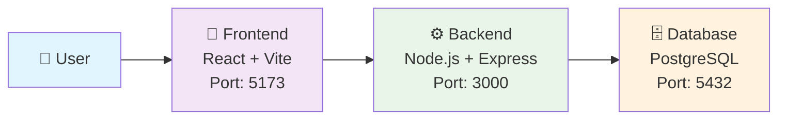
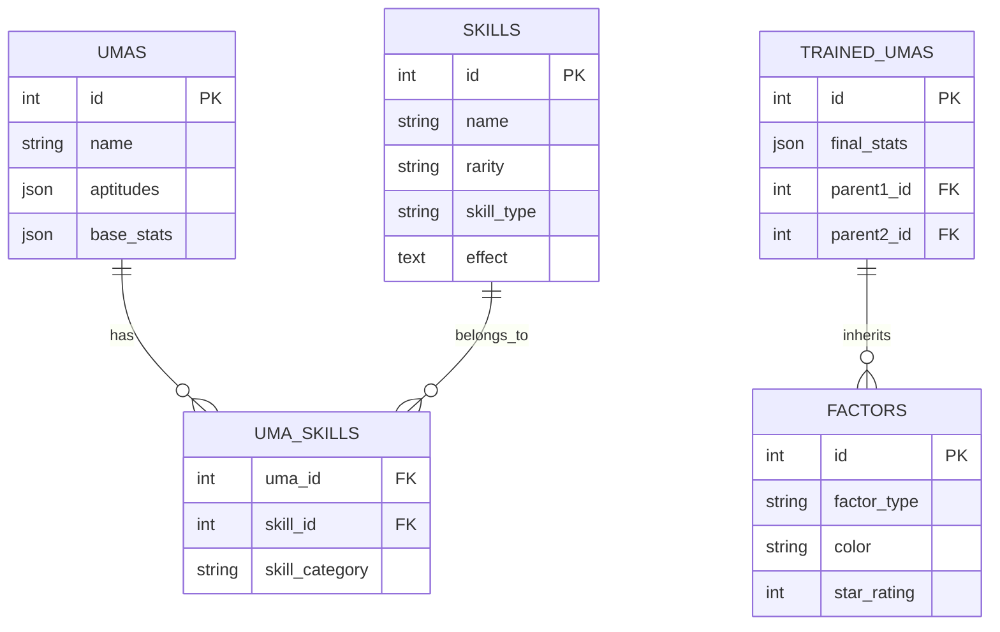
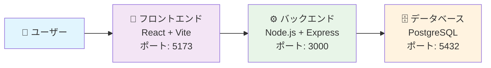

<div align="center">

# 🐎✨ Uma Musume Notes ✨🐎

<p align="center">
  
  
  
  
</p>

<p align="center">
  <strong>🌟 Platform database online komprehensif untuk Uma Musume Pretty Derby 🌟</strong>
</p>

</div>

---

<div align="center">

## 🌐 Language Selection

<table>
<tr>
<td align="center">
  <a href="#-uma-musume-notes-indonesia">
    
  </a>
</td>
<td align="center">
  <a href="#-uma-musume-notes-english">
    
  </a>
</td>
<td align="center">
  <a href="#-uma-musume-notes-japanese">
    
  </a>
</td>
</tr>
</table>

</div>

---

# 🐎 Uma Musume Notes (Indonesia)

> **Uma Musume Notes** adalah platform database online komprehensif yang didedikasikan untuk game **Uma Musume Pretty Derby**. Aplikasi ini terdiri dari frontend React modern dan backend REST API yang powerful!

<details>
<summary>📋 <strong>Daftar Isi</strong></summary>

- [🎯 Tujuan](#-tujuan)
- [🏗️ Arsitektur Sistem](#️-arsitektur-sistem)
- [📂 Repositori](#-repositori)
- [🚀 Tech Stack](#-tech-stack)
- [✨ Fitur Utama](#-fitur-utama)
- [📱 Preview Aplikasi](#-preview-aplikasi)
- [⚙️ Cara Menjalankan Project](#️-cara-menjalankan-project)
- [🎮 Fitur yang Tersedia](#-fitur-yang-tersedia)
- [🔧 Deployment](#-deployment)

</details>

## 🎯 Tujuan

<div align="center">
<table>
<tr>
<td align="center" width="25%">
  
  <br><strong>🗄️ Database Online</strong>
  <br><sub>Sistem penyimpanan terpusat</sub>
</td>
<td align="center" width="25%">
  
  <br><strong>📊 Collection Tracker</strong>
  <br><sub>Interface intuitif untuk progres</sub>
</td>
<td align="center" width="25%">
  
  <br><strong>🔌 API Terstruktur</strong>
  <br><sub>REST API yang skalabel</sub>
</td>
<td align="center" width="25%">
  
  <br><strong>📱 Responsive Design</strong>
  <br><sub>Optimized untuk semua device</sub>
</td>
</tr>
</table>
</div>

## 🏗️ Arsitektur Sistem

<div align="center">



</div>

<details>
<summary>🔄 <strong>Data Flow Process</strong></summary>

1. **👤 User Interaction** → User berinteraksi dengan React frontend
2. **📤 HTTP Request** → Frontend mengirim HTTP requests ke backend API
3. **⚙️ Processing** → Backend memproses request dan berkomunikasi dengan PostgreSQL
4. **🔄 ORM Query** → Database mengembalikan data melalui Sequelize ORM
5. **📥 JSON Response** → Backend mengirim JSON response ke frontend
6. **🎨 UI Update** → React Query melakukan caching dan update UI

</details>

## 📂 Repositori

<div align="center">
<table>
<tr>
<td align="center">
  <a href="https://github.com/zakkutsu/uma-notes-fe.git">
    
  </a>
  <br><sub><em>Repository ini</em></sub>
</td>
<td align="center">
  <a href="https://github.com/zakkutsu/uma-notes-be.git">
    
  </a>
</td>
</tr>
</table>
</div>

## 🚀 Tech Stack

<div align="center">

### 🎨 Frontend (Repository ini)
<p>
  
  
  
  
  
  
</p>

### ⚙️ Backend
<p>
  
  
  
  
  
  
</p>

</div>

## ✨ Fitur Utama

<div align="center">
<table>
<tr>
<td align="center" width="33%">
  <h3>🗄️ Comprehensive Database</h3>
  <ul align="left">
    <li>🐎 <strong>5+ Karakter Uma</strong> dengan 16 aptitude types</li>
    <li>⚡ <strong>Skills Database</strong> dengan rarity system</li>
    <li>🃏 <strong>Support Cards</strong> dengan tier system</li>
    <li>🧬 <strong>Inheritance Factors</strong> dengan color coding</li>
  </ul>
</td>
<td align="center" width="33%">
  <h3>🎨 Modern Frontend</h3>
  <ul align="left">
    <li>🏠 <strong>Homepage</strong> dengan database explorer</li>
    <li>📊 <strong>Collection Tracker</strong> personal management</li>
    <li>📱 <strong>Responsive Design</strong> mobile-first</li>
    <li>✨ <strong>Smooth Animations</strong> CSS transitions</li>
  </ul>
</td>
<td align="center" width="33%">
  <h3>🔌 Powerful Backend API</h3>
  <ul align="left">
    <li>🌐 <strong>RESTful Endpoints</strong> standard HTTP</li>
    <li>🤖 <strong>Smart Auto Seeder</strong> duplicate prevention</li>
    <li>🖼️ <strong>Image Management</strong> polymorphic relations</li>
    <li>🚀 <strong>Production Ready</strong> robust error handling</li>
  </ul>
</td>
</tr>
</table>
</div>

## 📱 Preview Aplikasi

<details>
<summary>🏗️ <strong>Database Structure</strong></summary>



</details>

<details>
<summary>🌐 <strong>API Endpoints</strong></summary>

<div align="center">

| Method | Endpoint | Description |
|--------|----------|-------------|
| 🟢 GET | `/api/v1/umas` | Get all umas dengan pagination |
| 🟢 GET | `/api/v1/umas/:id` | Get uma by ID |
| 🟡 POST | `/api/v1/umas` | Create new uma (dengan image upload) |
| 🟢 GET | `/api/v1/skills` | Get all skills dengan pagination |
| 🟢 GET | `/api/v1/skills/:id` | Get skill by ID |
| 🟢 GET | `/api/v1/support-cards` | Get all support cards |
| 🟢 GET | `/api/v1/factors` | Get all factors |
| 🟢 GET | `/api/v1/trained-umas` | Get all trained umas |

</div>

</details>

## ⚙️ Cara Menjalankan Project

### 📋 Prerequisites

<div align="center">
<table>
<tr>
<td align="center">
  
</td>
<td align="center">
  
</td>
<td align="center">
  
</td>
</tr>
</table>
</div>

### 🚀 Quick Start

<details>
<summary>⚙️ <strong>1. Backend Setup</strong></summary>

```bash
# 📥 Clone repository backend
git clone https://github.com/zakkutsu/uma-notes-be.git
cd uma-notes-be

# 📦 Install dependencies
npm install

# ⚙️ Setup environment (.env)
DB_HOST=localhost
DB_PORT=5432
DB_NAME=uma_notes_db
DB_USER=your_username
DB_PASSWORD=your_password
PORT=3000
AUTO_SEED=true

# 🐳 Start PostgreSQL dengan Docker
docker-compose up -d

# 🚀 Jalankan backend
npm run dev
# 🌐 Backend berjalan di http://localhost:3000
```

</details>

<details>
<summary>🎨 <strong>2. Frontend Setup</strong></summary>

```bash
# 📥 Clone repository frontend  
git clone https://github.com/zakkutsu/uma-notes-fe.git
cd uma-notes-fe

# 📦 Install dependencies
npm install

# ⚙️ Setup environment (.env)
VITE_API_BASE_URL=http://localhost:3000/api/v1
VITE_APP_TITLE=Uma Musume Notes

# 🚀 Jalankan frontend
npm run dev
# 🌐 Frontend berjalan di http://localhost:5173
```

</details>

<details>
<summary>✅ <strong>3. Verify Installation</strong></summary>

```bash
# 🧪 Test backend API
curl http://localhost:3000/api/v1/seed

# 🌐 Akses frontend di browser
http://localhost:5173
```

</details>

## 🎮 Fitur yang Tersedia

<div align="center">
<table>
<tr>
<th>🎨 Frontend Features</th>
<th>⚙️ Backend Features</th>
<th>🗄️ Database Features</th>
</tr>
<tr>
<td>
  ✅ Homepage Explorer<br/>
  ✅ Progress Tracker<br/>
  ✅ View All Pages<br/>
  ✅ Responsive Design<br/>
  ✅ Search Functionality<br/>
  ✅ Modal System
</td>
<td>
  ✅ RESTful API<br/>
  ✅ Auto Seeding<br/>
  ✅ Image Upload<br/>
  ✅ Error Handling<br/>
  ✅ Pagination<br/>
  ✅ Data Validation
</td>
<td>
  ✅ Normalized Schema<br/>
  ✅ Junction Tables<br/>
  ✅ Auto Migration<br/>
  ✅ Seeding Control<br/>
  ✅ Foreign Keys<br/>
  ✅ ERD Compliant
</td>
</tr>
</table>
</div>

## 🔧 Deployment

<div align="center">

### 🌟 Recommended Stack

<table>
<tr>
<td align="center">
  
</td>
<td align="center">
  
</td>
<td align="center">
  
</td>
</tr>
</table>

</div>

<details>
<summary>🔧 <strong>Environment Variables</strong></summary>

**Frontend (.env)**
```env
VITE_API_BASE_URL=https://your-backend-domain.com/api/v1
VITE_APP_TITLE=Uma Musume Notes
```

**Backend (.env)**
```env
DB_HOST=your_prod_host
DB_NAME=your_prod_db
DB_USERNAME=your_prod_user
DB_PASSWORD=your_prod_password
PORT=3000
NODE_ENV=production
AUTO_SEED=false
```

</details>

## 🏷️ Tags

<div align="center">
<p>
  
  
  
  
  
  
</p>
<p>
  
  
  
  
  
</p>
</div>

---

<div align="center">

## 📝 Development Notes

<details>
<summary>📁 <strong>Project Structure</strong></summary>

```
📁 uma-notes/ (Frontend)
├── 📁 src/
│   ├── 📁 components/      # 🎨 Reusable UI components
│   ├── 📁 pages/          # 📄 Route-level pages  
│   ├── 📁 api/            # 🔌 API layer & React Query hooks
│   ├── 📁 types/          # 📝 TypeScript definitions
│   └── 📁 constants/      # ⚙️ App constants

📁 node-uma-notes-be/ (Backend)  
├── 📁 controllers/        # 🎮 Route handlers
├── 📁 models/            # 🗄️ Sequelize models
├── 📁 routes/            # 🛣️ API route definitions
├── 📁 services/          # ⚙️ Business logic layer
├── 📁 seeders/           # 🌱 Database seeding
└── 📁 public/uploads/    # 📁 File upload storage
```

</details>

<details>
<summary>📊 <strong>API Response Format</strong></summary>

```json
{
  "meta": {
    "code": 200,
    "status": "Data berhasil diambil",
    "message": true,
    "isPaginated": true
  },
  "pagination": {
    "currentPage": 1,
    "totalPages": 3,
    "totalRows": 25,
    "limit": 10
  },
  "data": { /* ... */ }
}
```

</details>

</div>

---

<div align="center">

**🎉 Happy Coding! 🐎✨**

<p>
  <a href="https://github.com/zakkutsu">
    
  </a>
</p>

</div>

---

# 🐎 Uma Musume Notes (English)

> **Uma Musume Notes** is a comprehensive online database platform dedicated to the **Uma Musume Pretty Derby** game. This application consists of a modern React frontend and REST API backend that work seamlessly together!

<details>
<summary>📋 <strong>Table of Contents</strong></summary>

- [🎯 Objectives](#-objectives-1)
- [🏗️ System Architecture](#️-system-architecture-1)
- [📂 Repositories](#-repositories-1)
- [🚀 Tech Stack](#-tech-stack-1)
- [✨ Main Features](#-main-features)
- [⚙️ How to Run](#️-how-to-run-the-project)

</details>

## 🎯 Objectives

Building an **easily searchable and informative Uma Musume database website** with features:

<div align="center">
<table>
<tr>
<td align="center" width="25%">
  <strong>🗄️ Online Database</strong><br/>
  <sub>Centralized storage system</sub>
</td>
<td align="center" width="25%">
  <strong>📊 Collection Tracker</strong><br/>
  <sub>Intuitive progress interface</sub>
</td>
<td align="center" width="25%">
  <strong>🔌 Structured API</strong><br/>
  <sub>Scalable REST API</sub>
</td>
<td align="center" width="25%">
  <strong>📱 Responsive Design</strong><br/>
  <sub>Optimized for all devices</sub>
</td>
</tr>
</table>
</div>

## 🏗️ System Architecture

<div align="center">


</div>

**Data Flow:**
1. User interacts with React frontend
2. Frontend sends HTTP requests to backend API
3. Backend processes requests and communicates with PostgreSQL
4. Database returns data through Sequelize ORM
5. Backend sends JSON response to frontend
6. React Query performs caching and UI updates

## 📂 Repositories

<div align="center">
<table>
<tr>
<td align="center">
  <a href="https://github.com/zakkutsu/uma-notes-fe.git">
    
  </a>
  <br><sub><em>This Repository</em></sub>
</td>
<td align="center">
  <a href="https://github.com/zakkutsu/uma-notes-be.git">
    
  </a>
</td>
</tr>
</table>
</div>

## 🚀 Tech Stack

<div align="center">

### 🎨 Frontend (This Repository)
<p>
  
  
  
  
  
</p>

### ⚙️ Backend
<p>
  
  
  
  
</p>

</div>

## ✨ Main Features

<div align="center">
<table>
<tr>
<td align="center" width="33%">
  <h3>🗄️ Comprehensive Database</h3>
  <ul align="left">
    <li>🐎 <strong>5+ Uma Characters</strong> with 16 aptitude types</li>
    <li>⚡ <strong>Skills Database</strong> with rarity system</li>
    <li>🃏 <strong>Support Cards</strong> with tier system</li>
    <li>🧬 <strong>Inheritance Factors</strong> with color coding</li>
  </ul>
</td>
<td align="center" width="33%">
  <h3>🎨 Modern Frontend</h3>
  <ul align="left">
    <li>🏠 <strong>Homepage</strong> with database explorer</li>
    <li>📊 <strong>Collection Tracker</strong> personal management</li>
    <li>📱 <strong>Responsive Design</strong> mobile-first</li>
    <li>✨ <strong>Smooth Animations</strong> CSS transitions</li>
  </ul>
</td>
<td align="center" width="33%">
  <h3>🔌 Powerful Backend API</h3>
  <ul align="left">
    <li>🌐 <strong>RESTful Endpoints</strong> standard HTTP</li>
    <li>🤖 <strong>Smart Auto Seeder</strong> duplicate prevention</li>
    <li>🖼️ <strong>Image Management</strong> polymorphic relations</li>
    <li>🚀 <strong>Production Ready</strong> robust error handling</li>
  </ul>
</td>
</tr>
</table>
</div>

## ⚙️ How to Run the Project

### 📋 Prerequisites

<div align="center">
<table>
<tr>
<td align="center">
  
</td>
<td align="center">
  
</td>
<td align="center">
  
</td>
</tr>
</table>
</div>

### 🚀 Quick Start

<details>
<summary>⚙️ <strong>1. Backend Setup</strong></summary>

```bash
# 📥 Clone backend repository
git clone https://github.com/zakkutsu/uma-notes-be.git
cd uma-notes-be

# 📦 Install dependencies
npm install

# ⚙️ Setup environment (.env)
DB_HOST=localhost
DB_PORT=5432
DB_NAME=uma_notes_db
DB_USER=your_username
DB_PASSWORD=your_password
PORT=3000
AUTO_SEED=true

# 🐳 Start PostgreSQL with Docker
docker-compose up -d

# 🚀 Run backend
npm run dev
# 🌐 Backend runs at http://localhost:3000
```

</details>

<details>
<summary>🎨 <strong>2. Frontend Setup</strong></summary>

```bash
# 📥 Clone frontend repository  
git clone https://github.com/zakkutsu/uma-notes-fe.git
cd uma-notes-fe

# 📦 Install dependencies
npm install

# ⚙️ Setup environment (.env)
VITE_API_BASE_URL=http://localhost:3000/api/v1
VITE_APP_TITLE=Uma Musume Notes

# 🚀 Run frontend
npm run dev
# 🌐 Frontend runs at http://localhost:5173
```

</details>

---

<div align="center">

**🎉 Happy Coding! 🐎✨**

</div>

---

# 🐎 Uma Musume Notes (Japanese)

> **Uma Musume Notes** は、**ウマ娘 プリティーダービー** ゲーム専用の包括的なオンラインデータベースプラットフォームです。このアプリケーションは、モダンなReactフロントエンドと強力なREST APIバックエンドで構成されています！

<details>
<summary>📋 <strong>目次</strong></summary>

- [🎯 目標](#-目標-1)
- [🏗️ システムアーキテクチャ](#️-システムアーキテクチャ-1)
- [📂 リポジトリ](#-リポジトリ-1)
- [🚀 技術スタック](#-技術スタック-1)
- [✨ 主な機能](#-主な機能)
- [⚙️ プロジェクトの実行方法](#️-プロジェクトの実行方法-1)

</details>

## 🎯 目標

以下の機能を持つ**検索しやすく情報豊富なウマ娘データベースウェブサイト**の構築：

<div align="center">
<table>
<tr>
<td align="center" width="25%">
  <strong>🗄️ オンラインデータベース</strong><br/>
  <sub>集中ストレージシステム</sub>
</td>
<td align="center" width="25%">
  <strong>📊 コレクショントラッカー</strong><br/>
  <sub>直感的な進捗インターフェース</sub>
</td>
<td align="center" width="25%">
  <strong>🔌 構造化API</strong><br/>
  <sub>スケーラブルなREST API</sub>
</td>
<td align="center" width="25%">
  <strong>📱 レスポンシブデザイン</strong><br/>
  <sub>全デバイス最適化</sub>
</td>
</tr>
</table>
</div>

## 🏗️ システムアーキテクチャ

<div align="center">



</div>

**データフロー:**
1. ユーザーがReactフロントエンドと対話
2. フロントエンドがバックエンドAPIにHTTPリクエストを送信
3. バックエンドがリクエストを処理し、PostgreSQLと通信
4. データベースがSequelize ORMを通じてデータを返す
5. バックエンドがフロントエンドにJSONレスポンスを送信
6. React Queryがキャッシュとライキングするように更新

## 📂 リポジトリ

<div align="center">
<table>
<tr>
<td align="center">
  <a href="https://github.com/zakkutsu/uma-notes-fe.git">
    
  </a>
  <br><sub><em>このリポジトリ</em></sub>
</td>
<td align="center">
  <a href="https://github.com/zakkutsu/uma-notes-be.git">
    
  </a>
</td>
</tr>
</table>
</div>

## 🚀 技術スタック

<div align="center">

### 🎨 フロントエンド (このリポジトリ)
<p>
  
  
  
  
  
</p>

### ⚙️ バックエンド
<p>
  
  
  
  
</p>

</div>

## ✨ 主な機能

<div align="center">
<table>
<tr>
<td align="center" width="33%">
  <h3>🗄️ 包括的データベース</h3>
  <ul align="left">
    <li>🐎 <strong>5+ウマ娘キャラクター</strong> 16適性タイプ完全対応</li>
    <li>⚡ <strong>スキルデータベース</strong> レアリティシステム付き</li>
    <li>🃏 <strong>サポートカード</strong> ティアシステム付き</li>
    <li>🧬 <strong>継承ファクター</strong> カラーコーディング付き</li>
  </ul>
</td>
<td align="center" width="33%">
  <h3>🎨 モダンフロントエンド</h3>
  <ul align="left">
    <li>🏠 <strong>ホームページ</strong> データベースエクスプローラー付き</li>
    <li>📊 <strong>コレクショントラッカー</strong> 個人管理</li>
    <li>📱 <strong>レスポンシブデザイン</strong> モバイルファースト</li>
    <li>✨ <strong>スムーズアニメーション</strong> CSSトランジション</li>
  </ul>
</td>
<td align="center" width="33%">
  <h3>🔌 強力なバックエンドAPI</h3>
  <ul align="left">
    <li>🌐 <strong>RESTfulエンドポイント</strong> 標準HTTP</li>
    <li>🤖 <strong>スマート自動シーダー</strong> 重複防止</li>
    <li>🖼️ <strong>画像管理</strong> ポリモーフィックリレーション</li>
    <li>🚀 <strong>プロダクション対応</strong> 堅牢エラーハンドリング</li>
  </ul>
</td>
</tr>
</table>
</div>

## ⚙️ プロジェクトの実行方法

### 📋 前提条件

<div align="center">
<table>
<tr>
<td align="center">
  
</td>
<td align="center">
  
</td>
<td align="center">
  
</td>
</tr>
</table>
</div>

### 🚀 クイックスタート

<details>
<summary>⚙️ <strong>1. バックエンドセットアップ</strong></summary>

```bash
# 📥 バックエンドリポジトリをクローン
git clone https://github.com/zakkutsu/uma-notes-be.git
cd uma-notes-be

# 📦 依存関係をインストール
npm install

# ⚙️ 環境設定 (.env)
DB_HOST=localhost
DB_PORT=5432
DB_NAME=uma_notes_db
DB_USER=your_username
DB_PASSWORD=your_password
PORT=3000
AUTO_SEED=true

# 🐳 DockerでPostgreSQLを起動
docker-compose up -d

# 🚀 バックエンドを実行
npm run dev
# 🌐 バックエンドは http://localhost:3000 で動作
```

</details>

<details>
<summary>🎨 <strong>2. フロントエンドセットアップ</strong></summary>

```bash
# 📥 フロントエンドリポジトリをクローン
git clone https://github.com/zakkutsu/uma-notes-fe.git
cd uma-notes-fe

# 📦 依存関係をインストール
npm install

# ⚙️ 環境設定 (.env)
VITE_API_BASE_URL=http://localhost:3000/api/v1
VITE_APP_TITLE=Uma Musume Notes

# 🚀 フロントエンドを実行
npm run dev
# 🌐 フロントエンドは http://localhost:5173 で動作
```

</details>

---

<div align="center">

**🎉 Happy Coding! 🐎✨**

</div>
<div align="center">

# 🐎✨ Uma Musume Notes ✨🐎

<p align="center">
  
  
  
  
</p>

<p align="center">
  <strong>🌟 Platform database online komprehensif untuk Uma Musume Pretty Derby 🌟</strong>
</p>

</div>

---

<div align="center">

## 🌐 Language Selection

<table>
<tr>
<td align="center">
  <a href="#-uma-musume-notes-indonesia">
    
  </a>
</td>
<td align="center">
  <a href="#-uma-musume-notes-english">
    
  </a>
</td>
<td align="center">
  <a href="#-uma-musume-notes-japanese">
    
  </a>
</td>
</tr>
</table>

</div>

---

# 🐎 Uma Musume Notes (Indonesia)

> **Uma Musume Notes** adalah platform database online komprehensif yang didedikasikan untuk game **Uma Musume Pretty Derby**. Aplikasi ini terdiri dari frontend React modern dan backend REST API yang powerful!

<details>
<summary>📋 <strong>Daftar Isi</strong></summary>

- [🎯 Tujuan](#-tujuan)
- [🏗️ Arsitektur Sistem](#️-arsitektur-sistem)
- [📂 Repositori](#-repositori)
- [🚀 Tech Stack](#-tech-stack)
- [✨ Fitur Utama](#-fitur-utama)
- [📱 Preview Aplikasi](#-preview-aplikasi)
- [⚙️ Cara Menjalankan Project](#️-cara-menjalankan-project)
- [🎮 Fitur yang Tersedia](#-fitur-yang-tersedia)
- [🔧 Deployment](#-deployment)

</details>

## 🎯 Tujuan

<div align="center">
<table>
<tr>
<td align="center" width="25%">
  
  <br><strong>🗄️ Database Online</strong>
  <br><sub>Sistem penyimpanan terpusat</sub>
</td>
<td align="center" width="25%">
  
  <br><strong>📊 Collection Tracker</strong>
  <br><sub>Interface intuitif untuk progres</sub>
</td>
<td align="center" width="25%">
  
  <br><strong>🔌 API Terstruktur</strong>
  <br><sub>REST API yang skalabel</sub>
</td>
<td align="center" width="25%">
  
  <br><strong>📱 Responsive Design</strong>
  <br><sub>Optimized untuk semua device</sub>
</td>
</tr>
</table>
</div>

## 🏗️ Arsitektur Sistem

<div align="center">


</div>

<details>
<summary>🔄 <strong>Data Flow Process</strong></summary>

1. **👤 User Interaction** → User berinteraksi dengan React frontend
2. **📤 HTTP Request** → Frontend mengirim HTTP requests ke backend API
3. **⚙️ Processing** → Backend memproses request dan berkomunikasi dengan PostgreSQL
4. **🔄 ORM Query** → Database mengembalikan data melalui Sequelize ORM
5. **📥 JSON Response** → Backend mengirim JSON response ke frontend
6. **🎨 UI Update** → React Query melakukan caching dan update UI

</details>

## 📂 Repositori

<div align="center">
<table>
<tr>
<td align="center">
  <a href="https://github.com/zakkutsu/uma-notes-fe.git">
    
  </a>
  <br><sub><em>Repository ini</em></sub>
</td>
<td align="center">
  <a href="https://github.com/zakkutsu/uma-notes-be.git">
    
  </a>
</td>
</tr>
</table>
</div>

## 🚀 Tech Stack

<div align="center">

### 🎨 Frontend (Repository ini)
<p>
  
  
  
  
  
  
</p>

### ⚙️ Backend
<p>
  
  
  
  
  
  
</p>

</div>

## ✨ Fitur Utama

<div align="center">
<table>
<tr>
<td align="center" width="33%">
  <h3>🗄️ Comprehensive Database</h3>
  <ul align="left">
    <li>🐎 <strong>5+ Karakter Uma</strong> dengan 16 aptitude types</li>
    <li>⚡ <strong>Skills Database</strong> dengan rarity system</li>
    <li>🃏 <strong>Support Cards</strong> dengan tier system</li>
    <li>🧬 <strong>Inheritance Factors</strong> dengan color coding</li>
  </ul>
</td>
<td align="center" width="33%">
  <h3>🎨 Modern Frontend</h3>
  <ul align="left">
    <li>🏠 <strong>Homepage</strong> dengan database explorer</li>
    <li>📊 <strong>Collection Tracker</strong> personal management</li>
    <li>📱 <strong>Responsive Design</strong> mobile-first</li>
    <li>✨ <strong>Smooth Animations</strong> CSS transitions</li>
  </ul>
</td>
<td align="center" width="33%">
  <h3>🔌 Powerful Backend API</h3>
  <ul align="left">
    <li>🌐 <strong>RESTful Endpoints</strong> standard HTTP</li>
    <li>🤖 <strong>Smart Auto Seeder</strong> duplicate prevention</li>
    <li>🖼️ <strong>Image Management</strong> polymorphic relations</li>
    <li>🚀 <strong>Production Ready</strong> robust error handling</li>
  </ul>
</td>
</tr>
</table>
</div>

## 📱 Preview Aplikasi

<details>
<summary>🏗️ <strong>Database Structure</strong></summary>


</details>

<details>
<summary>🌐 <strong>API Endpoints</strong></summary>

<div align="center">

| Method | Endpoint | Description |
|--------|----------|-------------|
| 🟢 GET | `/api/v1/umas` | Get all umas dengan pagination |
| 🟢 GET | `/api/v1/umas/:id` | Get uma by ID |
| 🟡 POST | `/api/v1/umas` | Create new uma (dengan image upload) |
| 🟢 GET | `/api/v1/skills` | Get all skills dengan pagination |
| 🟢 GET | `/api/v1/skills/:id` | Get skill by ID |
| 🟢 GET | `/api/v1/support-cards` | Get all support cards |
| 🟢 GET | `/api/v1/factors` | Get all factors |
| 🟢 GET | `/api/v1/trained-umas` | Get all trained umas |

</div>

</details>

## ⚙️ Cara Menjalankan Project

### 📋 Prerequisites

<div align="center">
<table>
<tr>
<td align="center">
  
</td>
<td align="center">
  
</td>
<td align="center">
  
</td>
</tr>
</table>
</div>

### 🚀 Quick Start

<details>
<summary>⚙️ <strong>1. Backend Setup</strong></summary>

```bash
# 📥 Clone repository backend
git clone https://github.com/zakkutsu/uma-notes-be.git
cd uma-notes-be

# 📦 Install dependencies
npm install

# ⚙️ Setup environment (.env)
DB_HOST=localhost
DB_PORT=5432
DB_NAME=uma_notes_db
DB_USER=your_username
DB_PASSWORD=your_password
PORT=3000
AUTO_SEED=true

# 🐳 Start PostgreSQL dengan Docker
docker-compose up -d

# 🚀 Jalankan backend
npm run dev
# 🌐 Backend berjalan di http://localhost:3000
```

</details>

<details>
<summary>🎨 <strong>2. Frontend Setup</strong></summary>

```bash
# 📥 Clone repository frontend  
git clone https://github.com/zakkutsu/uma-notes-fe.git
cd uma-notes-fe

# 📦 Install dependencies
npm install

# ⚙️ Setup environment (.env)
VITE_API_BASE_URL=http://localhost:3000/api/v1
VITE_APP_TITLE=Uma Musume Notes

# 🚀 Jalankan frontend
npm run dev
# 🌐 Frontend berjalan di http://localhost:5173
```

</details>

<details>
<summary>✅ <strong>3. Verify Installation</strong></summary>

```bash
# 🧪 Test backend API
curl http://localhost:3000/api/v1/seed

# 🌐 Akses frontend di browser
http://localhost:5173
```

</details>

## 🎮 Fitur yang Tersedia

<div align="center">
<table>
<tr>
<th>🎨 Frontend Features</th>
<th>⚙️ Backend Features</th>
<th>🗄️ Database Features</th>
</tr>
<tr>
<td>
  ✅ Homepage Explorer<br/>
  ✅ Progress Tracker<br/>
  ✅ View All Pages<br/>
  ✅ Responsive Design<br/>
  ✅ Search Functionality<br/>
  ✅ Modal System
</td>
<td>
  ✅ RESTful API<br/>
  ✅ Auto Seeding<br/>
  ✅ Image Upload<br/>
  ✅ Error Handling<br/>
  ✅ Pagination<br/>
  ✅ Data Validation
</td>
<td>
  ✅ Normalized Schema<br/>
  ✅ Junction Tables<br/>
  ✅ Auto Migration<br/>
  ✅ Seeding Control<br/>
  ✅ Foreign Keys<br/>
  ✅ ERD Compliant
</td>
</tr>
</table>
</div>

## 🔧 Deployment

<div align="center">

### 🌟 Recommended Stack

<table>
<tr>
<td align="center">
  
</td>
<td align="center">
  
</td>
<td align="center">
  
</td>
</tr>
</table>

</div>

<details>
<summary>🔧 <strong>Environment Variables</strong></summary>

**Frontend (.env)**
```env
VITE_API_BASE_URL=https://your-backend-domain.com/api/v1
VITE_APP_TITLE=Uma Musume Notes
```

**Backend (.env)**
```env
DB_HOST=your_prod_host
DB_NAME=your_prod_db
DB_USERNAME=your_prod_user
DB_PASSWORD=your_prod_password
PORT=3000
NODE_ENV=production
AUTO_SEED=false
```

</details>

## 🏷️ Tags

<div align="center">
<p>
  
  
  
  
  
  
</p>
<p>
  
  
  
  
  
</p>
</div>

---

<div align="center">

## 📝 Development Notes

<details>
<summary>📁 <strong>Project Structure</strong></summary>

```
📁 uma-notes/ (Frontend)
├── 📁 src/
│   ├── 📁 components/      # 🎨 Reusable UI components
│   ├── 📁 pages/          # 📄 Route-level pages  
│   ├── 📁 api/            # 🔌 API layer & React Query hooks
│   ├── 📁 types/          # 📝 TypeScript definitions
│   └── 📁 constants/      # ⚙️ App constants

📁 node-uma-notes-be/ (Backend)  
├── 📁 controllers/        # 🎮 Route handlers
├── 📁 models/            # 🗄️ Sequelize models
├── 📁 routes/            # 🛣️ API route definitions
├── 📁 services/          # ⚙️ Business logic layer
├── 📁 seeders/           # 🌱 Database seeding
└── 📁 public/uploads/    # 📁 File upload storage
```

</details>

<details>
<summary>📊 <strong>API Response Format</strong></summary>

```json
{
  "meta": {
    "code": 200,
    "status": "Data berhasil diambil",
    "message": true,
    "isPaginated": true
  },
  "pagination": {
    "currentPage": 1,
    "totalPages": 3,
    "totalRows": 25,
    "limit": 10
  },
  "data": { /* ... */ }
}
```

</details>

</div>

---

<div align="center">

**🎉 Happy Coding! 🐎✨**

<p>
  <a href="https://github.com/zakkutsu">
    
  </a>
</p>

</div>

---

# 🐎 Uma Musume Notes (English)

> **Uma Musume Notes** is a comprehensive online database platform dedicated to the **Uma Musume Pretty Derby** game. This application consists of a modern React frontend and REST API backend that work seamlessly together!

<details>
<summary>📋 <strong>Table of Contents</strong></summary>

- [🎯 Objectives](#-objectives-1)
- [🏗️ System Architecture](#️-system-architecture-1)
- [📂 Repositories](#-repositories-1)
- [🚀 Tech Stack](#-tech-stack-1)
- [✨ Main Features](#-main-features)
- [⚙️ How to Run](#️-how-to-run-the-project)

</details>

## 🎯 Objectives

Building an **easily searchable and informative Uma Musume database website** with features:

<div align="center">
<table>
<tr>
<td align="center" width="25%">
  <strong>🗄️ Online Database</strong><br/>
  <sub>Centralized storage system</sub>
</td>
<td align="center" width="25%">
  <strong>📊 Collection Tracker</strong><br/>
  <sub>Intuitive progress interface</sub>
</td>
<td align="center" width="25%">
  <strong>🔌 Structured API</strong><br/>
  <sub>Scalable REST API</sub>
</td>
<td align="center" width="25%">
  <strong>📱 Responsive Design</strong><br/>
  <sub>Optimized for all devices</sub>
</td>
</tr>
</table>
</div>

## 🏗️ System Architecture

<div align="center">


</div>

**Data Flow:**
1. User interacts with React frontend
2. Frontend sends HTTP requests to backend API
3. Backend processes requests and communicates with PostgreSQL
4. Database returns data through Sequelize ORM
5. Backend sends JSON response to frontend
6. React Query performs caching and UI updates

## 📂 Repositories

<div align="center">
<table>
<tr>
<td align="center">
  <a href="https://github.com/zakkutsu/uma-notes-fe.git">
    
  </a>
  <br><sub><em>This Repository</em></sub>
</td>
<td align="center">
  <a href="https://github.com/zakkutsu/uma-notes-be.git">
    
  </a>
</td>
</tr>
</table>
</div>

## 🚀 Tech Stack

<div align="center">

### 🎨 Frontend (This Repository)
<p>
  
  
  
  
  
</p>

### ⚙️ Backend
<p>
  
  
  
  
</p>

</div>

## ✨ Main Features

<div align="center">
<table>
<tr>
<td align="center" width="33%">
  <h3>🗄️ Comprehensive Database</h3>
  <ul align="left">
    <li>🐎 <strong>5+ Uma Characters</strong> with 16 aptitude types</li>
    <li>⚡ <strong>Skills Database</strong> with rarity system</li>
    <li>🃏 <strong>Support Cards</strong> with tier system</li>
    <li>🧬 <strong>Inheritance Factors</strong> with color coding</li>
  </ul>
</td>
<td align="center" width="33%">
  <h3>🎨 Modern Frontend</h3>
  <ul align="left">
    <li>🏠 <strong>Homepage</strong> with database explorer</li>
    <li>📊 <strong>Collection Tracker</strong> personal management</li>
    <li>📱 <strong>Responsive Design</strong> mobile-first</li>
    <li>✨ <strong>Smooth Animations</strong> CSS transitions</li>
  </ul>
</td>
<td align="center" width="33%">
  <h3>🔌 Powerful Backend API</h3>
  <ul align="left">
    <li>🌐 <strong>RESTful Endpoints</strong> standard HTTP</li>
    <li>🤖 <strong>Smart Auto Seeder</strong> duplicate prevention</li>
    <li>🖼️ <strong>Image Management</strong> polymorphic relations</li>
    <li>🚀 <strong>Production Ready</strong> robust error handling</li>
  </ul>
</td>
</tr>
</table>
</div>

## ⚙️ How to Run the Project

### 📋 Prerequisites

<div align="center">
<table>
<tr>
<td align="center">
  
</td>
<td align="center">
  
</td>
<td align="center">
  
</td>
</tr>
</table>
</div>

### 🚀 Quick Start

<details>
<summary>⚙️ <strong>1. Backend Setup</strong></summary>

```bash
# 📥 Clone backend repository
git clone https://github.com/zakkutsu/uma-notes-be.git
cd uma-notes-be

# 📦 Install dependencies
npm install

# ⚙️ Setup environment (.env)
DB_HOST=localhost
DB_PORT=5432
DB_NAME=uma_notes_db
DB_USER=your_username
DB_PASSWORD=your_password
PORT=3000
AUTO_SEED=true

# 🐳 Start PostgreSQL with Docker
docker-compose up -d

# 🚀 Run backend
npm run dev
# 🌐 Backend runs at http://localhost:3000
```

</details>

<details>
<summary>🎨 <strong>2. Frontend Setup</strong></summary>

```bash
# 📥 Clone frontend repository  
git clone https://github.com/zakkutsu/uma-notes-fe.git
cd uma-notes-fe

# 📦 Install dependencies
npm install

# ⚙️ Setup environment (.env)
VITE_API_BASE_URL=http://localhost:3000/api/v1
VITE_APP_TITLE=Uma Musume Notes

# 🚀 Run frontend
npm run dev
# 🌐 Frontend runs at http://localhost:5173
```

</details>

---

<div align="center">

**🎉 Happy Coding! 🐎✨**

</div>

---

# 🐎 Uma Musume Notes (Japanese)

> **Uma Musume Notes** は、**ウマ娘 プリティーダービー** ゲーム専用の包括的なオンラインデータベースプラットフォームです。このアプリケーションは、モダンなReactフロントエンドと強力なREST APIバックエンドで構成されています！

<details>
<summary>📋 <strong>目次</strong></summary>

- [🎯 目標](#-目標-1)
- [🏗️ システムアーキテクチャ](#️-システムアーキテクチャ-1)
- [📂 リポジトリ](#-リポジトリ-1)
- [🚀 技術スタック](#-技術スタック-1)
- [✨ 主な機能](#-主な機能)
- [⚙️ プロジェクトの実行方法](#️-プロジェクトの実行方法-1)

</details>

## 🎯 目標

以下の機能を持つ**検索しやすく情報豊富なウマ娘データベースウェブサイト**の構築：

<div align="center">
<table>
<tr>
<td align="center" width="25%">
  <strong>🗄️ オンラインデータベース</strong><br/>
  <sub>集中ストレージシステム</sub>
</td>
<td align="center" width="25%">
  <strong>📊 コレクショントラッカー</strong><br/>
  <sub>直感的な進捗インターフェース</sub>
</td>
<td align="center" width="25%">
  <strong>🔌 構造化API</strong><br/>
  <sub>スケーラブルなREST API</sub>
</td>
<td align="center" width="25%">
  <strong>📱 レスポンシブデザイン</strong><br/>
  <sub>全デバイス最適化</sub>
</td>
</tr>
</table>
</div>

## 🏗️ システムアーキテクチャ

<div align="center">


</div>

**データフロー:**
1. ユーザーがReactフロントエンドと対話
2. フロントエンドがバックエンドAPIにHTTPリクエストを送信
3. バックエンドがリクエストを処理し、PostgreSQLと通信
4. データベースがSequelize ORMを通じてデータを返す
5. バックエンドがフロントエンドにJSONレスポンスを送信
6. React Queryがキャッシュとライキングするように更新

## 📂 リポジトリ

<div align="center">
<table>
<tr>
<td align="center">
  <a href="https://github.com/zakkutsu/uma-notes-fe.git">
    
  </a>
  <br><sub><em>このリポジトリ</em></sub>
</td>
<td align="center">
  <a href="https://github.com/zakkutsu/uma-notes-be.git">
    
  </a>
</td>
</tr>
</table>
</div>

## 🚀 技術スタック

<div align="center">

### 🎨 フロントエンド (このリポジトリ)
<p>
  
  
  
  
  
</p>

### ⚙️ バックエンド
<p>
  
  
  
  
</p>

</div>

## ✨ 主な機能

<div align="center">
<table>
<tr>
<td align="center" width="33%">
  <h3>🗄️ 包括的データベース</h3>
  <ul align="left">
    <li>🐎 <strong>5+ウマ娘キャラクター</strong> 16適性タイプ完全対応</li>
    <li>⚡ <strong>スキルデータベース</strong> レアリティシステム付き</li>
    <li>🃏 <strong>サポートカード</strong> ティアシステム付き</li>
    <li>🧬 <strong>継承ファクター</strong> カラーコーディング付き</li>
  </ul>
</td>
<td align="center" width="33%">
  <h3>🎨 モダンフロントエンド</h3>
  <ul align="left">
    <li>🏠 <strong>ホームページ</strong> データベースエクスプローラー付き</li>
    <li>📊 <strong>コレクショントラッカー</strong> 個人管理</li>
    <li>📱 <strong>レスポンシブデザイン</strong> モバイルファースト</li>
    <li>✨ <strong>スムーズアニメーション</strong> CSSトランジション</li>
  </ul>
</td>
<td align="center" width="33%">
  <h3>🔌 強力なバックエンドAPI</h3>
  <ul align="left">
    <li>🌐 <strong>RESTfulエンドポイント</strong> 標準HTTP</li>
    <li>🤖 <strong>スマート自動シーダー</strong> 重複防止</li>
    <li>🖼️ <strong>画像管理</strong> ポリモーフィックリレーション</li>
    <li>🚀 <strong>プロダクション対応</strong> 堅牢エラーハンドリング</li>
  </ul>
</td>
</tr>
</table>
</div>

## ⚙️ プロジェクトの実行方法

### 📋 前提条件

<div align="center">
<table>
<tr>
<td align="center">
  
</td>
<td align="center">
  
</td>
<td align="center">
  
</td>
</tr>
</table>
</div>

### 🚀 クイックスタート

<details>
<summary>⚙️ <strong>1. バックエンドセットアップ</strong></summary>

```bash
# 📥 バックエンドリポジトリをクローン
git clone https://github.com/zakkutsu/uma-notes-be.git
cd uma-notes-be

# 📦 依存関係をインストール
npm install

# ⚙️ 環境設定 (.env)
DB_HOST=localhost
DB_PORT=5432
DB_NAME=uma_notes_db
DB_USER=your_username
DB_PASSWORD=your_password
PORT=3000
AUTO_SEED=true

# 🐳 DockerでPostgreSQLを起動
docker-compose up -d

# 🚀 バックエンドを実行
npm run dev
# 🌐 バックエンドは http://localhost:3000 で動作
```

</details>

<details>
<summary>🎨 <strong>2. フロントエンドセットアップ</strong></summary>

```bash
# 📥 フロントエンドリポジトリをクローン
git clone https://github.com/zakkutsu/uma-notes-fe.git
cd uma-notes-fe

# 📦 依存関係をインストール
npm install

# ⚙️ 環境設定 (.env)
VITE_API_BASE_URL=http://localhost:3000/api/v1
VITE_APP_TITLE=Uma Musume Notes

# 🚀 フロントエンドを実行
npm run dev
# 🌐 フロントエンドは http://localhost:5173 で動作
```

</details>

---

<div align="center">

**🎉 Happy Coding! 🐎✨**

</div>
